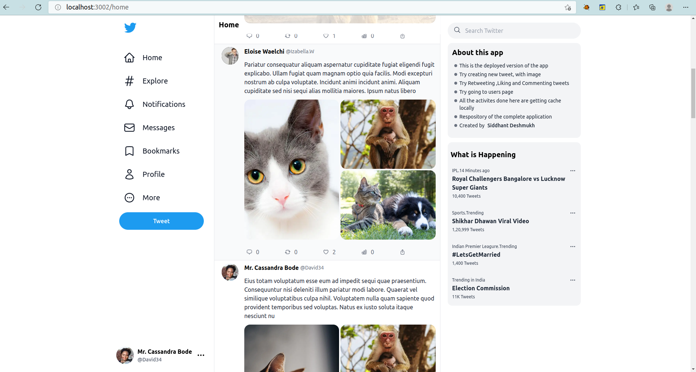
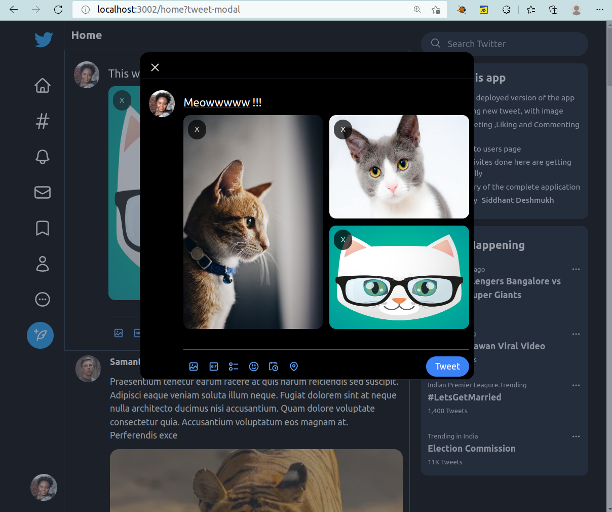
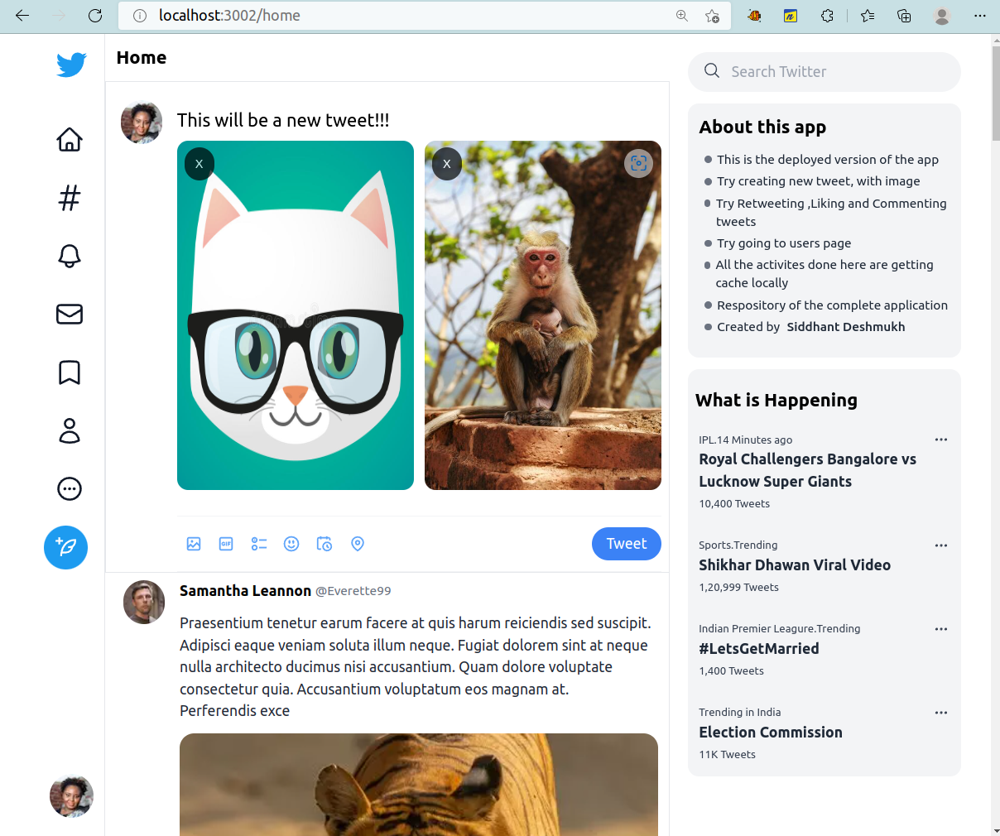
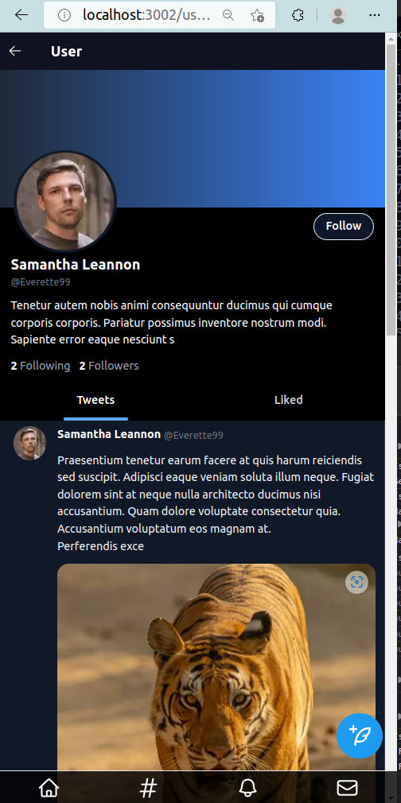

# Twitter Clone (Deployed Version)

This is a clone of Twitter made with NextJS. 

It uses 
1. **tailwindcss** for styling 
2. **SWR** for caching and state management in the frontend 
3. **Azure Blob Storage** to upload and get image or media
4. **Azure Cosmosdb for Mongodb** as the primary database.

*Note: As this is the deployed version all the upload or POST, PUT, DELETE operations are done withing frontend by manipulating state and caching to get the full version check out main branch https://github.com/siddhant-deshmukh/twitter-clone-using-nextjs*

Features
1. To upload a tweet with upto 4 images

2. Like ,Retweet and comment on a tweet
3. A good looking, responsive UI with Dark Mode

 
4. Home Feed, Users Page, Tweet Page and getting home feed, Comment Feed and Users tweet feed

